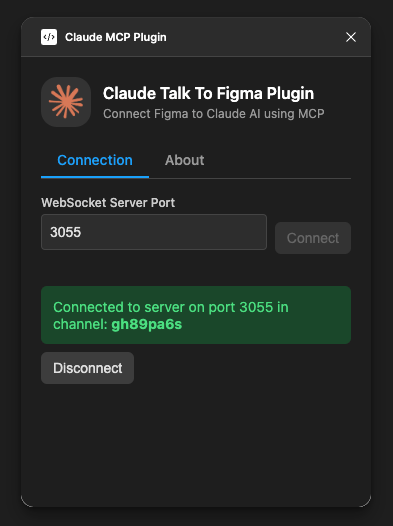

# Claude Talk to Figma MCP

A Model Context Protocol (MCP) plugin that allows Claude Desktop to interact directly with Figma, enabling powerful AI-assisted design capabilities.

> **Important**: This project is based on [cursor-talk-to-figma-mcp](https://github.com/sonnylazuardi/cursor-talk-to-figma-mcp) by Sonny Lazuardi. It has been adapted to work with Claude Desktop instead of Cursor. The original implementation and main credit belongs to Sonny Lazuardi ❤️

## 🚀 Features

- **Native Claude Integration**: Allows Claude to communicate with Figma through the Model Context Protocol (MCP)
- **Powerful Commands**: Manipulate objects in Figma, get information, create and modify elements
- **Bidirectional Communication**: Real-time WebSocket channel between Claude and Figma
- **Fluid Experience**: Design with AI as your assistant, accelerating creative workflows
- **Text Scanning**: Identify and manipulate text nodes within Figma documents

## 📋 Prerequisites

- [Claude Desktop](https://claude.ai/download) installed
- [Figma](https://figma.com) account
- [Bun](https://bun.sh) v1.0.0 or higher 
  - Linux macOS ```curl -fsSL https://bun.sh/install | bash```
  - Windows ```powershell -c "irm bun.sh/install.ps1 | iex"```
- [Cursor Talk to Figma MCP Plugin](https://www.figma.com/community/plugin/1485687494525374295/cursor-talk-to-figma-mcp-plugin) installed in Figma

## ⚙️ Installation

1. Clone this repository:
   ```bash
   git clone https://github.com/arinspunk/claude-talk-to-figma-mcp.git
   cd claude-talk-to-figma-mcp
   ```

2. Install dependencies:
   ```bash
   bun install
   ```

3. Build the project:
   ```bash
   bun run build
   ```

4. Configure the MCP in Claude Desktop:
   ```bash
   bun run configure-claude
   ```
   Restart Claude Desktop if it was open.

   > **Note**: This script does the following:
   
   - Locates the Claude Desktop configuration file:
     - On macOS: `~/Library/Application Support/Claude/claude_desktop_config.json`
     - On Windows: `%APPDATA%\Claude\claude_desktop_config.json`
   - Creates a backup of the existing configuration file
   - Modifies or creates the configuration file to include "ClaudeTalkToFigma" in the list of MCPs
   - Configures the command that Claude Desktop should execute to start the MCP

5. Install the Figma plugin
   [Cursor Talk to Figma MCP Plugin](https://www.figma.com/community/plugin/1485687494525374295/cursor-talk-to-figma-mcp-plugin)
   > **Note**: This project originally included a custom Figma plugin, but we now use the official plugin from Figma Community which provides the same functionality. The original plugin has been archived in this repository for reference.

## 🚀 Usage

### 🔌 Starting Up

Once installed, you just need to start it:

1. **Start the WebSocket server**:
   ```bash
   bun socket
   ```
   Verify it's running with `http://localhost:3055/status`
   
   To stop the server, press `Ctrl+C` in the terminal.

3. **Connect the plugin to the server**:

   Open the plugin in Figma and enter port 3055. This generates a channel ID, copy it to provide it to Claude.

   

4. **Claude Desktop**:

   Open Claude Desktop and confirm that "ClaudeTalkToFigma" appears in the MCPs selector.

5. **Ready to use!**

   Now you can send commands to Figma from Claude.

### 🧠 Prompting

1. Before you start designing with Claude, make it an expert in UX/UI 🎨

2. Now tell Claude to connect to your Figma project:
   ```
   Talk to Figma, channel {channel-ID}
   ```

## 🏛️ Architecture:

```
+----------------+     +-------+     +---------------+     +---------------+
|                |     |       |     |               |     |               |
| Claude Desktop |<--->|  MCP  |<--->| WebSocket Srv |<--->| Figma Plugin  |
|   (AI Agent)   |     |       |     |  (Port 3055)  |     |  (UI Plugin)  |
|                |     |       |     |               |     |               |
+----------------+     +-------+     +---------------+     +---------------+
```

## 🛠️ Available Commands

As Claude is connected to our MCP, it already knows the list of tools to manipulate Figma. But if you want, you can mention them in your prompts:  

- `clone_node`  
  Clone an existing node in Figma
- `create_component_instance`  
  Create an instance of a component in Figma
- `create_frame`  
  Create a new frame in Figma
- `create_rectangle`  
  Create a new rectangle in Figma
- `create_text`  
  Create a new text element in Figma
- `delete_node`  
  Delete a node from Figma
- `export_node_as_image`  
  Export a node as an image from Figma
- `get_document_info`  
  Get detailed information about the current Figma document
- `get_local_components`  
  Get all local components from the Figma document
- `get_node_info`  
  Get detailed information about a specific node in Figma
- `get_nodes_info`  
  Get detailed information about multiple nodes in Figma
- `get_selection`  
  Get information about the current selection in Figma
- `get_styles`  
  Get all styles from the current Figma document
- `join_channel`  
  Join a specific channel to communicate with Figma
- `move_node`  
  Move a node to a new position in Figma
- `resize_node`  
  Resize a node in Figma
- `scan_text_nodes`  
  Scan all text nodes in the selected Figma node
- `set_corner_radius`  
  Set the corner radius of a node in Figma
- `set_fill_color`  
  Set the fill color of a node in Figma can be TextNode or FrameNode
- `set_multiple_text_contents`  
  Set multiple text contents parallelly in a node
- `set_stroke_color`  
  Set the stroke color of a node in Figmaå
- `set_text_content`  
  Set the text content of an existing text node in Figma

## 🐛 Troubleshooting

If you encounter problems, check the following common issues:

### Common Issues

- **Connection Error**: Make sure the WebSocket server is running with `npx claude-talk-to-figma-mcp-socket`
- **Plugin Not Appearing**: Verify that you've correctly installed the plugin from Figma Community
- **Claude Can't Find the MCP**: Make sure you've run `bun run configure-claude` and restarted Claude Desktop
- **Claude Not Responding**: Confirm you've selected "ClaudeTalkToFigma" in the MCPs menu
- **Execution Errors**: Check the Figma development console for detailed messages

## 🧪 Testing

To run the integration tests:

```bash
bun run test
```

For more details about testing, see [TESTING.md](TESTING.md).

## 🤝 Contributions

Contributions are welcome. Please follow these steps:

1. Fork the repository
2. Create a branch for your feature (`git checkout -b feature/amazing-feature`)
3. Commit your changes (`git commit -m 'Add some amazing feature'`)
4. Push to the branch (`git push origin feature/amazing-feature`)
5. Open a Pull Request

## 📄 License

This project is under the MIT License - see the [LICENSE](LICENSE) file for details.

## 👥 Authors

- **Xúlio Zé** - *Adaptation for Claude* - [GitHub](https://github.com/arinspunk)
- **Sonny Lazuardi** - *Original Cursor implementation* - [GitHub](https://github.com/sonnylazuardi)

## 🙏 Acknowledgments

- Anthropic team for Claude and the Model Context Protocol
- Figma community for their excellent plugin API
- Sonny Lazuardi for the original Cursor Talk to Figma MCP implementation
- Bun team for providing a fast JavaScript runtime 
- Bun team for providing a fast JavaScript runtime 